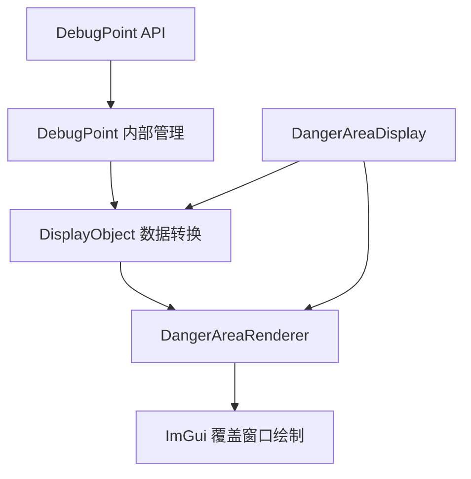

# 变更提案: debugpoint-renderer-refactor

## 元信息
```yaml
类型: 重构
方案类型: implementation
优先级: P1
状态: 草稿
创建: 2026-01-23
```

---

## 1. 需求

### 背景
- DebugPoint.cs 使用 `ImGui.GetForegroundDrawList()` 绘制调试点
- 用户反馈无法正常标记 debugpoint
- AE 提供的 trustdebug 也时不时无法绘制
- 说明前景绘制 API 在 FF14 环境下不稳定

### 目标
- 将 DebugPoint 改用 DangerAreaRenderer 的渲染方式
- 实现稳定可靠的调试点绘制功能
- 保持现有 API 不变，向后兼容

### 约束条件
```yaml
时间约束: 无
性能约束: 不应影响渲染性能
兼容性约束: 必须保持现有 API 不变（DebugPoint.Add, DebugPoint.Clear 等）
业务约束: 无
```

### 验收标准
- [ ] DebugPoint 能稳定绘制调试点
- [ ] 渲染稳定性与 DangerAreaRenderer 一致
- [ ] 现有 API 保持不变，无需修改调用代码
- [ ] 带文本标签的调试点正常显示

---

## 2. 方案

### 技术方案
1. **扩展 DangerAreaRenderer 支持动态对象**
   - 允许外部模块向 DangerAreaRenderer 添加临时显示对象

2. **重构 DebugPoint 内部实现**
   - 移除独立的 Draw 事件订阅
   - 改用 DangerAreaRenderer 的覆盖窗口绘制
   - 保持静态方法 API 不变

### 影响范围
```yaml
涉及模块:
  - Utils/DebugPoint: 内部实现重构
  - Rendering/DangerAreaRenderer: 扩展接口支持外部对象
预计变更文件: 2
```

### 风险评估
| 风险 | 等级 | 应对 |
|------|------|------|
| DangerAreaRenderer 接口变更影响现有功能 | 低 | 采用扩展示例方式，不修改现有接口 |
| 渲染性能下降 | 低 | 复用现有渲染循环，无额外开销 |
| API 兼容性问题 | 低 | 保持静态方法签名不变 |

---

## 3. 技术设计

### 架构设计


### API设计
#### DangerAreaRenderer 扩展
- **新增方法**: `AddTempObjects(IEnumerable<DisplayObject> objects)`
- **说明**: 允许外部模块添加临时显示对象到渲染队列
- **生命周期**: 临时对象在每帧渲染后清空（或手动清空）

#### DebugPoint 内部改造
- **移除**: `_subscribed` 字段、`Initialize/Dispose` 方法的 Draw 事件订阅
- **新增**: `Render()` 方法，返回 `List<DisplayObject>` 供 DangerAreaRenderer 使用
- **保持**: `Add(Vector3)`, `Clear()`, `DebugPointWithText` 字段不变

### 数据模型
复用现有 `DisplayObjectDot`, `DisplayObjectLine`, `DisplayObjectText` 类型，无需新增。

---

## 4. 核心场景

> 执行完成后同步到对应模块文档

### 场景: 绘制调试点路径
**模块**: Utils/DebugPoint
**条件**: 用户调用 `DebugPoint.Add()` 添加位置点
**行为**:
  1. 将位置点存储到内部列表
  2. 在渲染时转换为 DisplayObjectLine 和 DisplayObjectDot
  3. 提交给 DangerAreaRenderer 绘制
**结果**: 游戏画面中显示红色路径和带序号的圆点

### 场景: 绘制带标签的调试点
**模块**: Utils/DebugPoint
**条件**: 用户向 `DebugPointWithText` 字典添加带标签的位置
**行为**:
  1. 存储标签和位置
  2. 在渲染时转换为 DisplayObjectDot 和 DisplayObjectText
  3. 提交给 DangerAreaRenderer 绘制
**结果**: 游戏画面中显示绿色圆点和黄色文本标签

---

## 5. 技术决策

> 本方案涉及的技术决策，归档后成为决策的唯一完整记录

### debugpoint-renderer-refactor#D001: 渲染方式选择
**日期**: 2026-01-23
**状态**: ✅采纳
**背景**: DebugPoint 使用前景绘制 API 不稳定，需要选择更可靠的渲染方式
**选项分析**:
| 选项 | 优点 | 缺点 |
|------|------|------|
| A: 修复现有 GetForegroundDrawList 方式 | 改动最小 | 前景 API 本身在 FF14 环境不稳定 |
| B: 改用 DangerAreaRenderer 的覆盖窗口 | 已验证可靠，与危险区域显示一致 | 需要适配接口 |
**决策**: 选择方案 B
**理由**: DangerAreaRenderer 的渲染方式已通过危险区域显示验证，稳定性有保障；复用成熟渲染系统便于长期维护
**影响**: Utils/DebugPoint 内部实现重构，Rendering/DangerAreaRenderer 扩展临时对象支持
